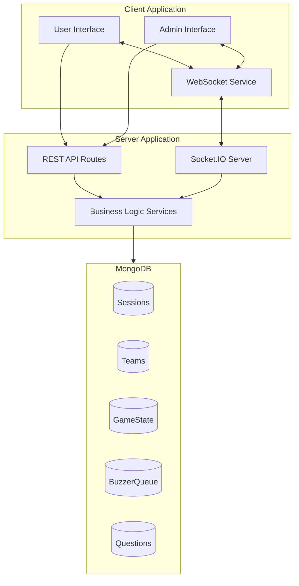
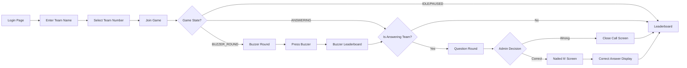
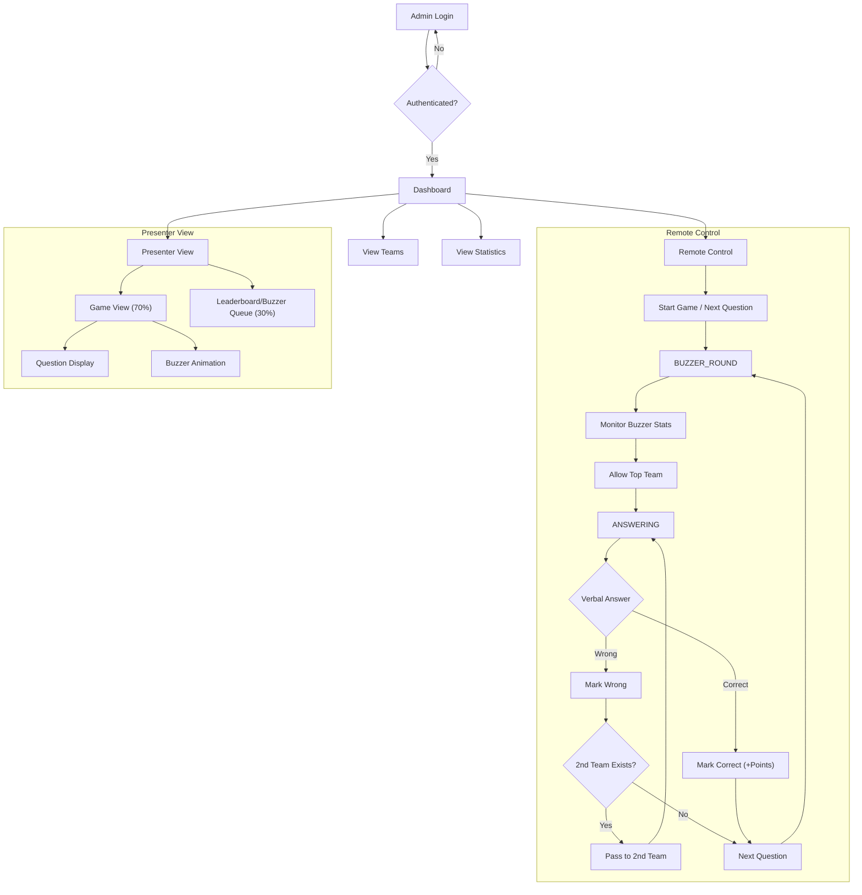
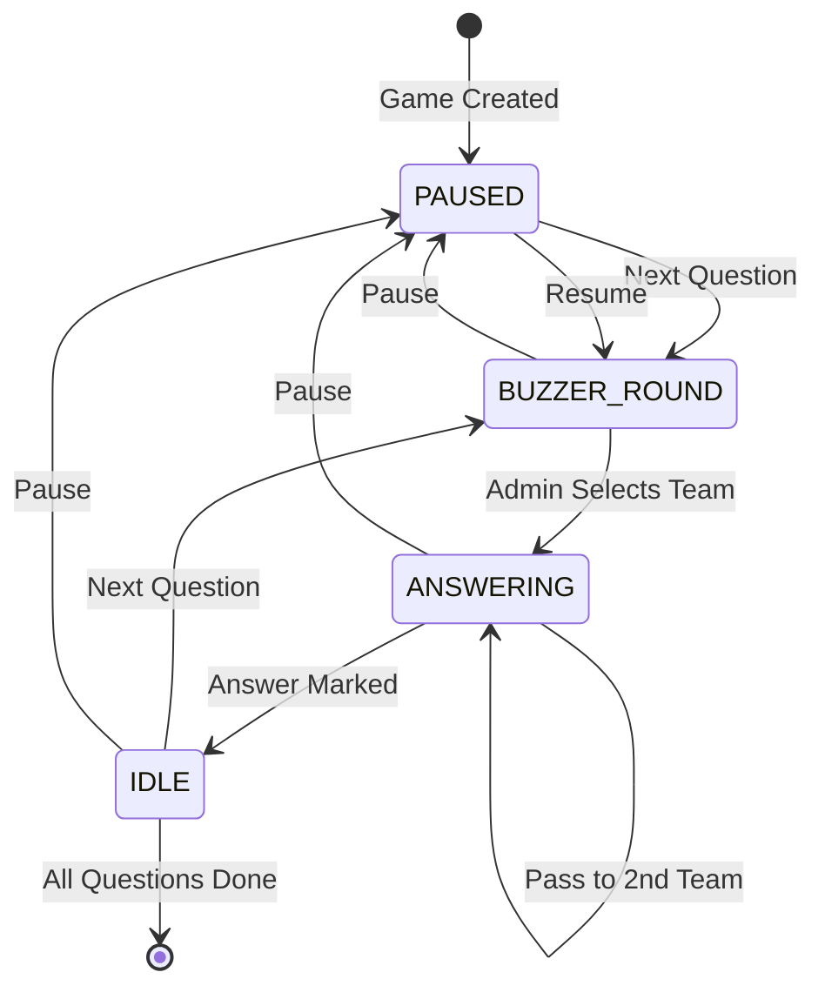
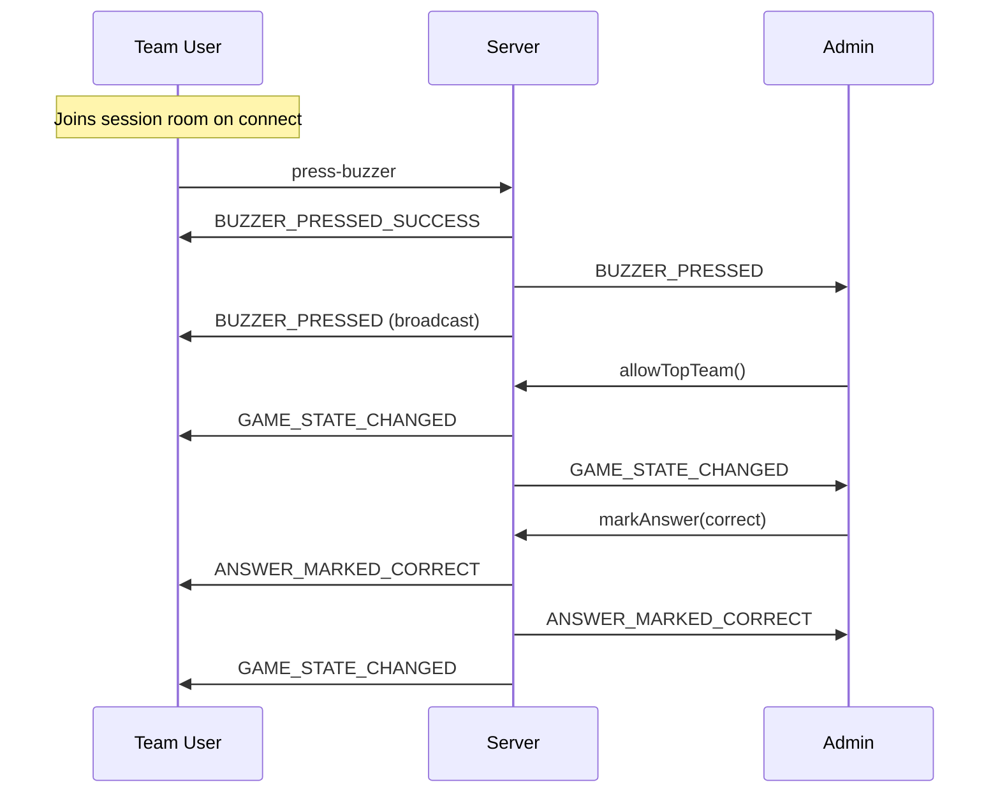

# Buzzer Battle - Project Overview

## Executive Summary

**Buzzer Battle** is a real-time interactive quiz game application designed for team-based competitions. The system enables multiple teams to compete by pressing buzzers to answer questions, with an admin controlling the game flow. The application features a modern React frontend and a Node.js/Express backend with real-time WebSocket communication.

---

## Technology Stack

| Layer | Technology |
|-------|------------|
| **Frontend** | React 18 + TypeScript, Vite, Redux Toolkit, MUI (Material UI) |
| **Backend** | Node.js, Express.js, TypeScript |
| **Database** | MongoDB with Mongoose ODM |
| **Real-time** | Socket.IO for WebSocket communication |
| **State Management** | Redux Toolkit with RTK Query |

---

## System Architecture



---

## Data Models

### Session
Represents a game session with configuration settings.
- `sessionName`: Name of the game session
- `numberOfTeams`: Total number of teams allowed
- `questionTimeLimit`: Time limit for buzzer round (seconds)
- `answerTimeLimit`: Time limit for answering (seconds)
- `questions`: Array of question references
- `status`: NOT_STARTED | IN_PROGRESS | ENDED

### Team
Represents a participating team.
- `teamNumber`: Assigned team number (1, 2, 3...)
- `teamName`: Custom team name (entered by users)
- `teamScore`: Cumulative score
- `session`: Reference to the session
- `joinedAt`: Timestamp of when team joined

### GameState
Tracks the current state of the game.
- `sessionId`: Reference to the session
- `currentQuestionIndex`: Current question being played
- `gameStatus`: PAUSED | BUZZER_ROUND | ANSWERING | IDLE
- `currentAnsweringTeam`: Team currently answering
- `buzzerRoundStartTime`: When buzzer round started
- `answeringRoundStartTime`: When answering round started

### BuzzerQueue
Records buzzer press events.
- `gameStateId`: Reference to game state
- `sessionId`: Reference to session
- `teamId`: Team that pressed the buzzer
- `questionId`: Question for which buzzer was pressed
- `timestamp`: Precise time of buzzer press (bigint)
- `ttl`: Time-to-live for auto-cleanup

### Question
Stores quiz questions.
- `questionText`: The question text
- `questionImage`: Optional image URL
- `questionVideo`: Optional video URL
- `options`: Multiple choice options
- `correctAnswer`: Index of correct option
- `score`: Points for correct answer

---

## User Roles & Functionality

## 1. Team User (Player)

### User Flow Diagram



### Features

| Feature | Description |
|---------|-------------|
| **Team Registration** | Enter team name (max 4 words, 50 chars, letters only), select team number |
| **Buzzer Press** | Tap buzzer button during buzzer round to compete for answering |
| **Buzzer Leaderboard** | View ranking of teams by buzzer press time (shows own team's time) |
| **Question Display** | View current question with text/image/video |
| **Answer Status** | Receive real-time feedback (Nailed It/Close Call) from admin's decision |
| **Overall Leaderboard** | View team rankings by total score |
| **Real-time Updates** | All screens update automatically via WebSocket |

### Screen Breakdown

1. **Login Page** (`login.Page.tsx`)
   - Team name input with validation
   - Team number dropdown selection
   - Start button to join session

2. **Buzzer Round** (`Buzzer_Round.tsx`)
   - Question display (text, image, video)
   - Large buzzer button
   - Auto-redirects when pressed

3. **Buzzer Leaderboard** (`BuzzerLeaderboard.tsx`)
   - Shows teams ranked by buzzer press time
   - Highlights current team
   - Shows answering team indicator
   - Displays time only for own team

4. **Question Round** (`Question_Round_Page.tsx`)
   - Question display for answering team
   - "Waiting for admin" overlay
   - Verbal answer flow (no MCQ selection)

5. **Leaderboard** (`LeaderBoard_Page.tsx`)
   - Overall score leaderboard
   - Podium-style top 3 display

---

## 2. Administrator

### Admin Flow Diagram



### Features

| Feature | Description |
|---------|-------------|
| **Admin Login** | Secure authentication to access admin controls |
| **Dashboard** | Overview of session, teams, and statistics |
| **Team Management** | View all teams, update names/scores, view responses |
| **Remote Control** | Full game control interface |
| **Presenter View** | Large-screen display for audience |
| **Notifications** | Real-time alerts for game events |

### Remote Control Actions

| Action | Description | When Available |
|--------|-------------|----------------|
| **Start/Next Question** | Moves to next question and starts buzzer round | PAUSED or IDLE |
| **Pause Game** | Pauses the game | Any active state |
| **Resume Game** | Resumes buzzer round | PAUSED |
| **Allow Top Team** | Selects fastest buzzer team to answer | BUZZER_ROUND |
| **Mark Correct** | Awards points for correct verbal answer | ANSWERING |
| **Mark Wrong** | Marks answer as incorrect | ANSWERING |
| **Pass to 2nd Team** | Gives 2nd fastest team a chance | ANSWERING (after wrong) |

### Screen Breakdown

1. **Admin Login** (`AdminLogin.tsx`)
   - Secure authentication form
   - Session validation

2. **Dashboard** (`DshboardPage.tsx`)
   - Header with session info and game status
   - Team cards with scores
   - Edit team names/scores
   - View team responses

3. **Remote Control** (`RemoteControl.tsx`)
   - Question progress indicator
   - Game status display
   - Current answering team info
   - Buzzer stats (during buzzer round)
   - Action buttons (context-sensitive)

4. **Presenter View** (`PresenterView.tsx`)
   - Split-screen layout (70/30)
   - Left: Question/Game display
   - Right: Buzzer queue or leaderboard
   - Audio controls for sound effects

---

## Game States & Flow

### State Machine



### State Descriptions

| State | Description | User View | Admin Actions |
|-------|-------------|-----------|---------------|
| **PAUSED** | Game not active | Waiting screen | Start/Resume |
| **BUZZER_ROUND** | Teams can press buzzer | Buzzer + Question | Allow Top Team |
| **ANSWERING** | Selected team answers verbally | Question (answering team) / Leaderboard (others) | Mark Correct/Wrong, Pass to 2nd |
| **IDLE** | Between answer and next question | Leaderboard | Next Question |

---

## Real-time Events (WebSocket)

### Event Flow



### Key Events

| Event | Sender | Description |
|-------|--------|-------------|
| `BUZZER_PRESSED` | Server | Broadcasted when any team presses buzzer |
| `GAME_STATE_CHANGED` | Server | Game status or state updated |
| `ANSWER_MARKED_CORRECT` | Server | Admin marked answer as correct |
| `ANSWER_MARKED_WRONG` | Server | Admin marked answer as wrong |
| `QUESTION_PASSED` | Server | Question passed to 2nd team |

---

## API Endpoints Summary

### Session APIs
- `GET /api/v1/session` - Fetch session details
- `GET /api/v1/session/teams/:sessionId` - Get total teams count

### Team APIs
- `POST /api/v1/teams` - Create/join team
- `GET /api/v1/teams/me` - Get current team info
- `GET /api/v1/teams/leaderboard` - Get overall leaderboard

### Game State APIs
- `GET /api/v1/game-state` - Get current game state
- `POST /api/v1/game-state/pause` - Pause game
- `POST /api/v1/game-state/resume` - Resume game
- `POST /api/v1/game-state/next-question` - Move to next question
- `POST /api/v1/game-state/auto-select-fastest/:questionId` - Select fastest team
- `POST /api/v1/game-state/pass-to-second/:questionId` - Pass to 2nd team
- `POST /api/v1/game-state/mark-answer` - Mark answer correct/wrong

### Buzzer APIs
- `GET /api/v1/buzzer/leaderboard` - Get buzzer leaderboard
- `GET /api/v1/buzzer/stats` - Get buzzer statistics

### Question APIs
- `GET /api/v1/questions/current` - Get current question

### Admin APIs
- `POST /api/v1/admin/login` - Admin login
- `GET /api/v1/admin/me` - Get admin info
- `GET /api/v1/admin/dashboard` - Get dashboard data
- `PUT /api/v1/admin/teams/:teamId` - Update team info
- `GET /api/v1/admin/teams/:teamId/responses` - Get team responses

---

## Project Structure

```
Buzzer-Battel/
├── client/                          # Frontend Application
│   ├── src/
│   │   ├── App.tsx                  # Main router
│   │   ├── pages/
│   │   │   ├── gameMain.tsx         # User routes
│   │   │   └── adminMain.tsx        # Admin routes
│   │   ├── features/
│   │   │   ├── admin/               # Admin module
│   │   │   │   ├── pages/           # Admin pages
│   │   │   │   ├── components/      # Admin components
│   │   │   │   └── services/        # Admin API & hooks
│   │   │   ├── game/                # Game module
│   │   │   │   ├── pages/           # Game pages
│   │   │   │   ├── components/      # Game components
│   │   │   │   └── services/        # Game API & state
│   │   │   ├── question/            # Question module
│   │   │   └── session/             # Session module
│   │   ├── services/
│   │   │   └── websocket/           # WebSocket service
│   │   ├── components/              # Shared components
│   │   └── app/                     # Redux store
│   └── package.json
│
└── server/                          # Backend Application
    ├── src/
    │   ├── index.ts                 # Server entry point
    │   ├── modules/
    │   │   ├── admin/               # Admin module
    │   │   ├── buzzerQueue/         # Buzzer queue module
    │   │   ├── gameState/           # Game state module
    │   │   ├── questions/           # Questions module
    │   │   ├── session/             # Session module
    │   │   └── teams/               # Teams module
    │   ├── services/
    │   │   └── socket/              # Socket.IO service
    │   │       ├── index.ts         # Socket initialization
    │   │       ├── roomManager.ts   # Room management
    │   │       └── handelers/       # Event handlers
    │   └── middlewares/             # Express middlewares
    └── package.json
```

---

## Key Features Summary

### For Teams/Players
✅ Join game with custom team name  
✅ Press buzzer to compete for answering  
✅ View buzzer rankings (own time only)  
✅ Answer questions verbally  
✅ Receive real-time feedback on answers  
✅ View overall leaderboard and rankings  
✅ Automatic navigation based on game state  

### For Administrators
✅ Secure admin authentication  
✅ Full game flow control  
✅ Real-time buzzer statistics  
✅ Mark verbal answers correct/wrong  
✅ Pass questions to 2nd fastest team  
✅ Team management (edit names/scores)  
✅ Presenter view for audience display  
✅ Notifications for game events  

### Technical Features
✅ Real-time WebSocket communication  
✅ Responsive mobile-first design  
✅ Redux state management  
✅ TypeScript for type safety  
✅ MongoDB for data persistence  
✅ Modular architecture  

---

## Deployment Notes

- **Client**: Vite build, can be deployed to any static hosting
- **Server**: Node.js application with MongoDB connection
- **WebSocket**: Requires WebSocket support (Socket.IO compatible)
- **Environment Variables**:
  - `VITE_BACKEND_WEBSOCKET_URL` (client)
  - `MONGODB_URI`, `PORT`, `FRONTEND_URL` (server)

---

*Document prepared for project management review*  
*Last Updated: January 27, 2026*
